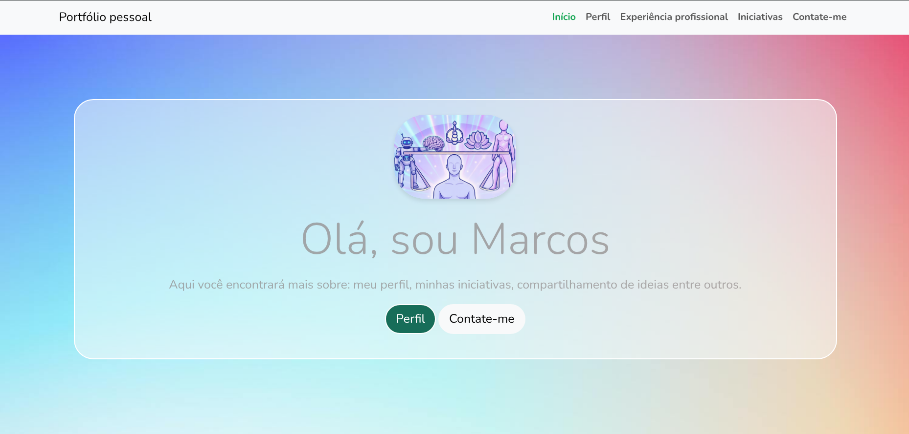

# 🎨 [Portfólio do Marcos](https://m32pinto.github.io/portfoliodomarcos/) —Template de portfólio  Bootstrap 5 

> *Um modelo de portfólio responsivo, fácil de usar e totalmente personalizável. Ideal para designers, desenvolvedores e criadores de conteúdo.*

---

## 📌 Descrição

Este é um **template de portfólio** construído com **Bootstrap 5**, **HTML5 semântico** e **JavaScript leve**, com estrutura modular e totalmente responsiva.

O template inclui:

✅ Página principal com apresentação  
✅ Galeria de imagens  
✅ Mini blog para iniciativas, participações ou reflexões  
✅ Formulário de contato integrado 

Perfeito para quem quer mostrar seu trabalho, confesso que é muito eficiente para mostrar projetos ou conteúdo pessoal de forma profissional — sem precisar de conhecimento avançado de codificação.

---

## 🖼️ Uma prévia

### Veja uma prévia do início,  [veja mais🔗](https://m32pinto.github.io/portfoliodomarcos/)  

<div align="center">
  
</div>


## 🛠️ Tecnologias Utilizadas

- ✅ **HTML5** — Estrutura semântica e acessível  
- ✅ **Bootstrap 5** — Responsividade, componentes e estilização rápida  
- ✅ **JavaScript** — Funcionalidades interativas (formulários, carrosséis)  
- ✅ **CSS Flexbox & Grid** — Layouts modernos e adaptáveis  
- ✅ **Qwenai qwenai-v1-4b** — Agente de IA, copiloto 
- ✅ **Emailjs** — Para envio de emails, recebimento e confirmação de contato automático. 


---

## 📦 Como Usar

1. Baixe o template (ou copie o código HTML) clicando aqui.
2. Personalize as imagens, conteúdo e estilos.
3. Adicione seu próprio conteúdo no blog ou no formulário.
4. Depois de personalizar, publique em qualquer site ou plataforma.

> *Este template é 100% livre de uso — você pode adaptá-lo para seu site, blog ou portfólio pessoal.*

---

## 📈 Live Demo

🔗 [Visualize o projeto em ação]([https://b5-portfolio-template.netlify.app/](https://m32pinto.github.io/portfoliodomarcos/))

---

## 📩 Autor

> *Siga o projeto original na sua rede.*

- 🖥️ GitHub — [@ecemgo](https://github.com/ecemgo)  
- 🎨 CodePen — [@ecemgo](https://codepen.io/ecemgo)  
- 🎥 YouTube — [@ecemgokdogan](https://www.youtube.com/channel/UCktkPv17cw27PaFGcnZa_aQ)  
- 🐦 Twitter — [@ecemgo](https://twitter.com/ecemgo)

---

## 💡 Dicas

- Adapte as imagens e conteúdo conforme sua necessidade.
- Use o formulário para entrar em contato — funcional e fácil de configurar, caso queira contatar basta preencher.


---

## 🧩 O que eu gosto de fazer com esse template?

- Mostrar projetos criativos  
- Compartilhar ideias e experiências  
- Receber feedbacks e sugestões  
- Tornar o portfólio mais interativo e envolvente

---

Se você gostou, me segue nas redes sociais — eu adoro receber feedbacks e ajudar com sugestões!📨

- 🎥 [Youtube](https://www.youtube.com/@se_re_ny)

- ❎ [X](https://twitter.com/ecemgo)

- 📷 [Instagram](https://x.com/m32pinto) 

- 📷 [Threads](https://www.threads.com/@marcosasp_psa)

- 💻[Linkedin](www.linkedin.com/in/marcos-antonio-78a930197)


- 🖥️ [Github](https://github.com/m32pinto)


---


> 🎯 *Este template é uma versão do trabalho de @ecemgo — e eu gostaria de agradecer o brilhante trabalho. 😊*

---

## 📝 Explicações das alterações feitas 


<details open>
<summary> ⬅️ Clique aqui para recolher as informações - Instrução que para a reprodução do iframe no modal 26/12/2025.</summary>

**Nessa alteração eu planejava fazer com que os vídeos parassem de ser reproduzidos se for clicado fora ou no botão close do modal, linha 272 - 289 no index.**

<div align="center">
  
  </div>

  ```json
  <script>
  document.addEventListener('click', function(e) {
    if (e.target.closest('.modal')) {
      const modal = e.target.closest('.modal');
      if (modal) {
        const iframes = modal.querySelectorAll('iframe');
        iframes.forEach(function(iframe) {
          if (iframe.src) {
            const newSrc = iframe.src + '&autoplay=0';
            iframe.src = newSrc;
          }
        });
      }
    }
});
```
**Linha 1: `document.addEventListener('click', function(e) {`**  
O código começa ouvindo quando alguém clica em qualquer parte da página.  
Quando alguém clica, o código vai executar o que está dentro do `function(e) {` — ou seja, o que vem depois.

---

**Linha 2: `if (e.target.closest('.modal')) {`**  
O código pergunta:  
“O que foi clicado (e.target) está dentro de algum elemento que tenha a classe `.modal`?”  
Se sim, o código continua.

---

**Linha 3: `const modal = e.target.closest('.modal');`**  
Se a resposta foi sim, o código pega o elemento `.modal` mais próximo que contém o clique.

---

**Linha 4: `if (modal) {`**  
Se o elemento `.modal` foi encontrado (ou seja, se `modal` não é `null` ou `undefined`), o código continua.

---

**Linha 5: `const iframes = modal.querySelectorAll('iframe');`**  
O código busca todos os elementos `<iframe>` dentro do modal encontrado.

---

**Linha 6: `iframes.forEach(function(iframe) {`**  
O código percorre todos os iframes encontrados, um por um.

---

**Linha 7: `if (iframe.src) {`**  
O código pergunta:  
“O iframe tem uma URL (src) definida?”  
Se sim, o código continua.

---

**Linha 8: `const newSrc = iframe.src + '&autoplay=0';`**  
O código cria uma nova URL, adicionando `&autoplay=0` ao final da URL atual.

---

**Linha 9: `iframe.src = newSrc;`**  
O código atualiza a URL do iframe, para que o vídeo não comece a tocar automaticamente.

---

**Linha 10: `}`**  
Fim do `forEach` — o código volta para o próximo iframe.

---

**Linha 11: `}`**  
Fim do `if (modal)` — o código volta para o próximo bloco.

---

**Linha 12: `}`**  
Fim do `if (e.target.closest('.modal'))` — o código volta para o próximo bloco.

---

**Linha 13: `}`**  
Fim do `addEventListener` — o código termina.


</details>
